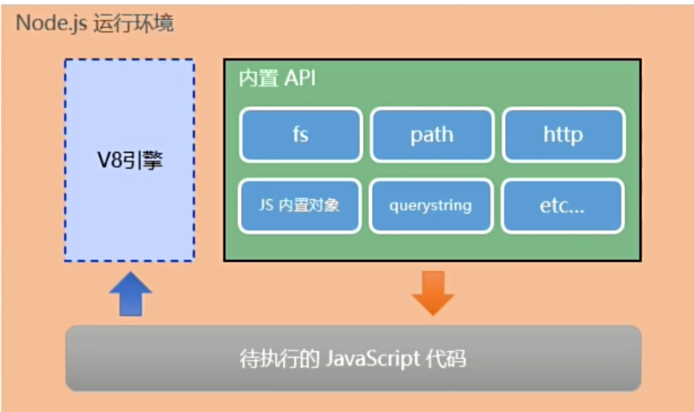
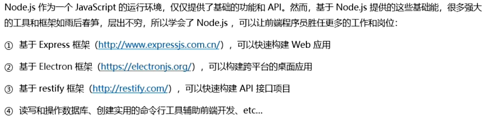
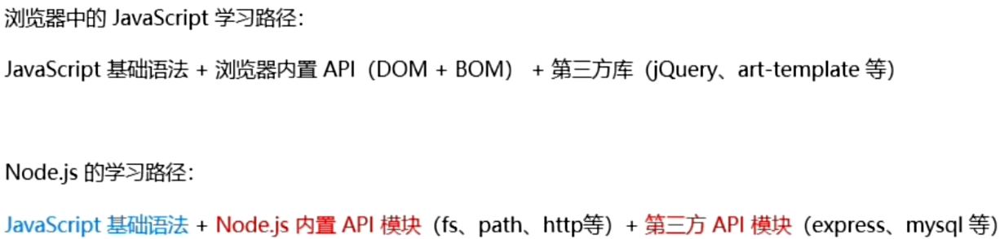

## 初识Node.js

1. 什么是Node.js
Node.js是一个基于Chrome V8引擎的JavaScript运行环境
2. Node.js中的JavaScript运行环境

   * 浏览器是 JavaScript的前端运行环境
   * Node.js是JavaScript的后端运行环境
   * Node.js中无法调用DOM和BOM等浏览器内置API
3. Node.js可以做什么

4. Node.js学习

